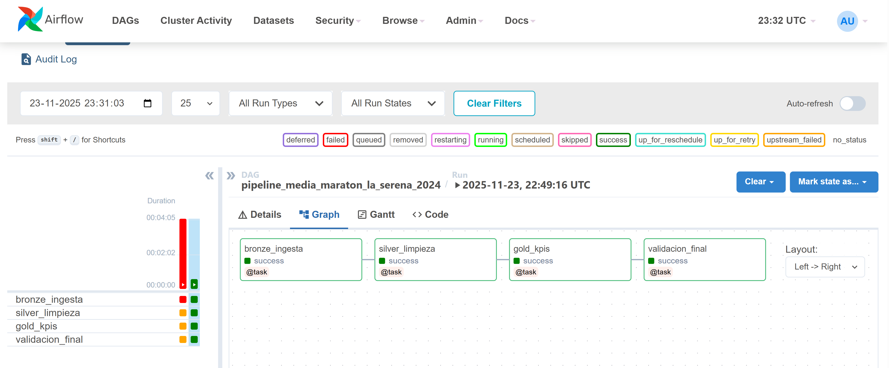

# 🏃 Pipeline Analytics - Media Maratón La Serena 2024

[](https://airflow.apache.org/)
[](https://python.org/)
[](https://docker.com/)
[](https://pandas.pydata.org/)
[](LICENSE)
[]()

---

## 📋 Tabla de Contenidos

1. [Objetivos](#-objetivos)
2. [Descripción del Conjunto de Datos](#-descripción-del-conjunto-de-datos)
3. [Stack Tecnológico](#-stack-tecnológico)
4. [Arquitectura del Proyecto](#-arquitectura-del-proyecto)
5. [Flujo de los Datos](#-flujo-de-los-datos)
6. [Calidad de los Datos](#-calidad-de-los-datos)
7. [Instalación y Configuración](#-instalación-y-configuración)
8. [Uso del Pipeline](#-uso-del-pipeline)
9. [Estructura del Proyecto](#-estructura-del-proyecto)
10. [KPIs Generados](#-kpis-generados)
11. [Monitoreo y Logs](#-monitoreo-y-logs)
12. [Troubleshooting](#-troubleshooting)
13. [Roadmap](#-roadmap)
14. [Contribuciones](#-contribuciones)
15. [Licencia](#-licencia)
16. [Contacto](#-contacto)

---

## 🎯 Objetivos

### Objetivo General

Desarrollar un **pipeline de datos end-to-end automatizado y escalable** que procese los resultados de la Media Maratón La Serena 2024, transformando datos crudos y desestructurados en insights accionables para análisis deportivo y toma de decisiones.

### Objetivos Específicos

1. **Ingesta Automatizada**: Implementar un sistema de captura de datos que simule la recepción de archivos de resultados de carreras en formatos poco estructurados.

2. **Limpieza y Transformación**: Aplicar técnicas avanzadas de data wrangling con Pandas y expresiones regulares para:
   - Separar campos concatenados (categoría y número de dorsal)
   - Normalizar nombres de corredores
   - Convertir formatos de tiempo a métricas calculables
   - Estandarizar tipos de datos

3. **Generación de Métricas de Valor**: Crear KPIs específicos del dominio deportivo:
   - Tiempos promedio por categoría y género
   - Rankings por velocidad y ritmo
   - Distribución demográfica de participantes
   - Análisis de rendimiento comparativo

4. **Orquestación Robusta**: Utilizar Apache Airflow para:
   - Automatizar la ejecución del pipeline
   - Gestionar dependencias entre tareas
   - Implementar reintentos automáticos ante fallos
   - Facilitar el monitoreo y debugging

5. **Containerización**: Emplear Docker para garantizar:
   - Reproducibilidad del entorno
   - Portabilidad entre diferentes sistemas operativos
   - Aislamiento de dependencias
   - Facilidad de despliegue

6. **Implementación de Best Practices**: Aplicar principios de ingeniería de datos moderna:
   - Arquitectura Medallion (Bronze-Silver-Gold)
   - Separación de responsabilidades
   - Logging estructurado
   - Manejo de errores robusto
   - Código documentado y mantenible

---

## 📊 Descripción del Conjunto de Datos

### Origen de los Datos

Los datos simulan resultados oficiales de la **Media Maratón La Serena 2024** (21.1 km), representando el formato típico en que organizadores de eventos deportivos entregan información: archivos CSV o Excel con campos concatenados y formatos inconsistentes.

### Características del Dataset

| Característica | Valor |
|----------------|-------|
| **Número de registros** | 25 corredores |
| **Formato original** | CSV con campos concatenados |
| **Distancia de carrera** | 21.1 km (media maratón) |
| **Categorías incluidas** | 7 categorías (por género y rango etario) |
| **Periodo simulado** | 2024 |

### Variables del Dataset Original (Bronze)

#### 📥 Datos de Entrada (Raw)

| Variable | Tipo | Descripción | Ejemplo | Problemas Comunes |
|----------|------|-------------|---------|-------------------|
| `pos_general` | String | Posición general en la carrera | `"127º"` | Incluye símbolo "º" |
| `pos_categoria` | String | Posición dentro de su categoría | `"47º"` | Incluye símbolo "º" |
| `nombre_corredor` | String | Nombre completo del participante | `"Abel Ballon Aguirre"` | Capitalización inconsistente |
| `categoria_dorsal` | String | **Campo problemático**: Categoría + dorsal concatenados | `"Varones 30 a 39 añosdorsal: 2395"` | Sin separador, requiere regex |
| `tiempo_oficial` | String | Tiempo en formato H:MM:SS | `"1:46:32"` | String, no numérico |

#### 🔍 Ejemplo de Registro Crudo

```csv
pos_general,pos_categoria,nombre_corredor,categoria_dorsal,tiempo_oficial
127º,47º,Abel Ballon Aguirre,Varones 30 a 39 añosdorsal: 2395,1:46:32
```

**Problemas identificados:**
- ❌ Símbolos "º" en posiciones
- ❌ Campo `categoria_dorsal` requiere parsing complejo
- ❌ Nombres pueden estar en minúsculas
- ❌ Tiempo como string no permite cálculos

---

### Variables del Dataset Transformado (Silver)

#### 📤 Datos de Salida (Clean)

Después del procesamiento en la capa Silver, los datos se estructuran así:

| Variable | Tipo | Descripción | Ejemplo | Transformación Aplicada |
|----------|------|-------------|---------|-------------------------|
| `pos_general` | Integer | Posición general (numérica) | `127` | Remover "º", convertir a int |
| `pos_categoria` | Integer | Posición en categoría (numérica) | `47` | Remover "º", convertir a int |
| `dorsal` | Integer | Número de dorsal del corredor | `2395` | Extraído con regex |
| `nombre_corredor` | String | Nombre normalizado | `"Abel Ballon Aguirre"` | Title case aplicado |
| `genero` | String | Género del corredor | `"Varones"` | Extraído con regex |
| `rango_edad` | String | Rango etario | `"30 a 39 años"` | Extraído con regex |
| `categoria` | String | Categoría completa | `"Varones 30 a 39 años"` | Reconstruida |
| `tiempo_oficial` | String | Tiempo original (referencia) | `"1:46:32"` | Conservado |
| `tiempo_segundos` | Integer | Tiempo total en segundos | `6392` | Calculado: H*3600 + M*60 + S |
| `ritmo_min_km` | String | Ritmo promedio por km | `"5:03"` | Calculado: tiempo / 21.1 km |
| `velocidad_kmh` | Float | Velocidad promedio | `11.86` | Calculada: 21.1 / (tiempo/3600) |

#### 🔍 Ejemplo de Registro Limpio

```csv
pos_general,pos_categoria,dorsal,nombre_corredor,genero,rango_edad,categoria,tiempo_oficial,tiempo_segundos,ritmo_min_km,velocidad_kmh
127,47,2395,Abel Ballon Aguirre,Varones,30 a 39 años,Varones 30 a 39 años,1:46:32,6392,5:03,11.86
```

---

### Categorías de Corredores

El dataset incluye las siguientes categorías, reflejando la estructura típica de carreras:

| Categoría | Género | Rango Etario | Participantes en Dataset |
|-----------|--------|--------------|--------------------------|
| Varones 18 a 29 años | Masculino | 18-29 | 2 |
| Varones 30 a 39 años | Masculino | 30-39 | 6 |
| Varones 40 a 49 años | Masculino | 40-49 | 2 |
| Varones 50 a 59 años | Masculino | 50-59 | 2 |
| Varones 60+ años | Masculino | 60+ | 2 |
| Damas 18 a 29 años | Femenino | 18-29 | 2 |
| Damas 30 a 39 años | Femenino | 30-39 | 2 |
| Damas 40 a 49 años | Femenino | 40-49 | 4 |
| Damas 50 a 59 años | Femenino | 50-59 | 2 |
| Damas 60+ años | Femenino | 60+ | 1 |

### Estadísticas Descriptivas del Dataset

```
Total de Corredores: 25
├─ Varones: 17 (68%)
└─ Damas: 8 (32%)

Tiempo más rápido: 1:12:45 (Carlos Andrés Díaz Moreno)
Tiempo más lento: 2:30:15 (Gabriela Fernanda Ríos)
Tiempo promedio: ~1:51:00
Ritmo promedio: ~5:16 min/km
```

---

## 🛠️ Stack Tecnológico

### Orquestación y Workflow

| Tecnología | Versión | Propósito | Justificación |
|------------|---------|-----------|---------------|
| **Apache Airflow** | 2.8.1 | Orquestador de workflows | Estándar de industria para pipelines complejos. Ofrece UI web, scheduler robusto, y gestión de dependencias. |
| **Python** | 3.11 | Lenguaje de programación principal | Ecosistema rico en librerías de datos. Sintaxis clara y amplia adopción en Data Engineering. |

### Procesamiento de Datos

| Tecnología | Versión | Propósito | Justificación |
|------------|---------|-----------|---------------|
| **Pandas** | 2.1.4 | Manipulación y análisis de datos | Librería líder para data wrangling. API intuitiva para transformaciones complejas. |
| **Regex (re)** | Built-in | Parsing de strings complejos | Esencial para extraer información de campos concatenados sin estructura fija. |
| **OpenPyXL** | 3.1.2 | Lectura de archivos Excel | Soporte completo para formatos .xlsx modernos. |

### Infraestructura y Despliegue

| Tecnología | Versión | Propósito | Justificación |
|------------|---------|-----------|---------------|
| **Docker** | 24.x | Containerización | Garantiza reproducibilidad del entorno. Simplifica despliegue multi-plataforma. |
| **Docker Compose** | 2.x | Orquestación de contenedores | Gestiona múltiples servicios (Airflow, PostgreSQL) con un solo comando. |
| **PostgreSQL** | 15 | Base de datos de metadatos | Backend estándar de Airflow. Alta confiabilidad y rendimiento. |

### Control de Versiones y Documentación

| Tecnología | Versión | Propósito | Justificación |
|------------|---------|-----------|---------------|
| **Git** | - | Control de versiones | Estándar de industria para versionado de código. |
| **Markdown** | - | Documentación | Formato universal, legible y compatible con Git. |

### Desarrollo y Testing

| Tecnología | Versión | Propósito |
|------------|---------|-----------|
| **Logging** | Built-in Python | Trazabilidad y debugging |
| **Pathlib** | Built-in Python | Manejo de rutas multiplataforma |
| **Type Hints** | Python 3.11+ | Documentación de tipos y mejor IDE support |

---

## 🏗️ Arquitectura del Proyecto

### Arquitectura Medallion (Bronze-Silver-Gold)

Este proyecto implementa el patrón **Medallion Architecture**, popularizado por Databricks y considerado best practice en lakehouse architecture.

```
┌─────────────────────────────────────────────────────────────────┐
│                     APACHE AIRFLOW (Orchestrator)               │
│                                                                 │
│  DAG: pipeline_media_maraton_la_serena_2024                    │
│  ┌──────────┐  ┌──────────┐  ┌──────────┐  ┌──────────┐      │
│  │  Bronze  │→ │  Silver  │→ │   Gold   │→ │ Validate │      │
│  │ Ingesta  │  │ Limpieza │  │   KPIs   │  │  Final   │      │
│  └──────────┘  └──────────┘  └──────────┘  └──────────┘      │
└─────────────────────────────────────────────────────────────────┘
         ↓              ↓              ↓              ↓
┌─────────────────────────────────────────────────────────────────┐
│                     DATA STORAGE (Filesystem)                    │
│  ┌──────────┐  ┌──────────┐  ┌──────────────────────┐          │
│  │  Bronze  │  │  Silver  │  │        Gold          │          │
│  │  /data   │  │  /data   │  │       /data          │          │
│  │  /bronze │  │  /silver │  │       /gold          │          │
│  │          │  │          │  │  ├─ kpi_stats.csv   │          │
│  │  raw.csv │  │clean.csv │  │  ├─ kpi_cat.csv     │          │
│  │          │  │          │  │  ├─ kpi_top5.csv    │          │
│  │          │  │          │  │  ├─ kpi_dist.csv    │          │
│  │          │  │          │  │  └─ kpi_ritmo.csv   │          │
│  └──────────┘  └──────────┘  └──────────────────────┘          │
└─────────────────────────────────────────────────────────────────┘
```

### Descripción de Capas

#### 🥉 Capa Bronze (Raw / Landing Zone)

**Propósito**: Almacenar datos exactamente como llegan de la fuente.

**Características**:
- ✅ Sin transformaciones
- ✅ Inmutable (append-only)
- ✅ Sirve como backup y punto de re-procesamiento
- ✅ Formato: CSV sin validación

**Output**: `data/bronze/resultados_raw.csv`

**Principio**: *"Preserve la fuente de verdad"*

---

#### 🥈 Capa Silver (Cleansed / Conformed)

**Propósito**: Datos limpios, validados y listos para análisis.

**Transformaciones Aplicadas**:
1. **Parsing de campos concatenados**
   ```python
   "Varones 30 a 39 añosdorsal: 2395"
   ↓
   genero: "Varones"
   rango_edad: "30 a 39 años"
   dorsal: 2395
   ```

2. **Limpieza de formatos**
   ```python
   "127º" → 127 (integer)
   "1:46:32" → 6392 (segundos)
   ```

3. **Normalización de nombres**
   ```python
   "alexandrina vivar diaz" → "Alexandrina Vivar Diaz"
   ```

4. **Enriquecimiento con métricas calculadas**
   ```python
   tiempo_segundos → ritmo_min_km, velocidad_kmh
   ```

**Output**: `data/silver/resultados_clean.csv`

**Principio**: *"Una sola versión de la verdad, limpia y estructurada"*

---

#### 🥇 Capa Gold (Curated / Business-Ready)

**Propósito**: Datos agregados y optimizados para consumo de negocio/análisis.

**KPIs Generados**:

| Archivo | Descripción | Uso |
|---------|-------------|-----|
| `kpi_estadisticas_generales.csv` | Métricas globales de la carrera | Dashboards ejecutivos |
| `kpi_tiempo_por_categoria.csv` | Promedios por categoría | Análisis comparativo |
| `kpi_top5_por_genero.csv` | Rankings por género | Premiaciones, prensa |
| `kpi_distribucion_edad.csv` | Demografía de participantes | Marketing, planeación |
| `kpi_top10_ritmo.csv` | Mejores ritmos overall | Análisis de élite |

**Principio**: *"Datos listos para decisiones, sin procesamiento adicional"*

---

### Componentes de Infraestructura

```
┌─────────────────────────────────────────────────────────────┐
│                    DOCKER COMPOSE                           │
│                                                             │
│  ┌────────────────┐  ┌────────────────┐  ┌──────────────┐ │
│  │   PostgreSQL   │  │    Airflow     │  │   Airflow    │ │
│  │   (Metadata)   │  │   Scheduler    │  │  Webserver   │ │
│  │                │  │                │  │              │ │
│  │  Puerto: 5432  │  │  - Ejecuta     │  │ Puerto: 8081 │ │
│  │                │  │    tareas      │  │ (UI Web)     │ │
│  │  - Historial   │  │  - Gestiona    │  │              │ │
│  │    de DAG runs │  │    dependencias│  │ - Monitoreo  │ │
│  │  - Conexiones  │  │  - Reintentos  │  │ - Ejecución  │ │
│  │  - Variables   │  │                │  │   manual     │ │
│  └────────────────┘  └────────────────┘  └──────────────┘ │
│         ↑                    ↑                    ↑        │
│         └────────────────────┴────────────────────┘        │
│                    Red interna Docker                      │
└─────────────────────────────────────────────────────────────┘
                              ↓
                    ┌──────────────────┐
                    │  Volúmenes       │
                    │  Montados        │
                    │                  │
                    │  ./dags     →    │
                    │  ./scripts  →    │
                    │  ./data     →    │
                    │  ./logs     →    │
                    └──────────────────┘
```

---

## 🔄 Flujo de los Datos

### Diagrama de Flujo Completo

```
┌─────────────────────────────────────────────────────────────────┐
│ INICIO: Usuario ejecuta DAG desde Airflow UI                   │
└─────────────────────────────────────────────────────────────────┘
                              ↓
┌─────────────────────────────────────────────────────────────────┐
│ TAREA 1: bronze_ingesta                                         │
│                                                                 │
│ Función: process_bronze()                                       │
│ Archivo: scripts/pipeline_tasks.py                             │
│                                                                 │
│ Proceso:                                                        │
│ 1. Crear directorio /data/bronze/ si no existe                 │
│ 2. Generar datos simulados (25 registros)                      │
│ 3. Crear DataFrame de Pandas con columnas raw                  │
│ 4. Guardar como CSV sin transformaciones                       │
│                                                                 │
│ Input:  Ninguno (datos simulados)                              │
│ Output: /data/bronze/resultados_raw.csv                        │
│ Tiempo: ~1-2 segundos                                           │
└─────────────────────────────────────────────────────────────────┘
                              ↓
┌─────────────────────────────────────────────────────────────────┐
│ TAREA 2: silver_limpieza                                        │
│                                                                 │
│ Función: process_silver(bronze_file)                            │
│ Archivo: scripts/pipeline_tasks.py                             │
│                                                                 │
│ Proceso:                                                        │
│ 1. Leer CSV de Bronze con pd.read_csv()                        │
│ 2. Aplicar regex a 'categoria_dorsal':                         │
│    Pattern: ^(Varones|Damas)\s+(.+?)dorsal:\s*(\d+)$          │
│    → Extraer: genero, rango_edad, dorsal                       │
│ 3. Limpiar posiciones (remover 'º', cast a int)                │
│ 4. Normalizar nombres con .str.title()                         │
│ 5. Calcular métricas:                                           │
│    - tiempo_segundos = H*3600 + M*60 + S                       │
│    - ritmo_min_km = tiempo / 21.1 km                            │
│    - velocidad_kmh = 21.1 / (tiempo/3600)                      │
│ 6. Reordenar columnas para legibilidad                         │
│ 7. Guardar CSV limpio                                           │
│                                                                 │
│ Input:  /data/bronze/resultados_raw.csv                        │
│ Output: /data/silver/resultados_clean.csv                      │
│ Tiempo: ~2-3 segundos                                           │
└─────────────────────────────────────────────────────────────────┘
                              ↓
┌─────────────────────────────────────────────────────────────────┐
│ TAREA 3: gold_kpis                                              │
│                                                                 │
│ Función: process_gold(silver_file)                              │
│ Archivo: scripts/pipeline_tasks.py                             │
│                                                                 │
│ Proceso:                                                        │
│ 1. Leer CSV de Silver                                           │
│ 2. Generar 5 KPIs:                                              │
│                                                                 │
│    KPI 1: Estadísticas Generales                               │
│    - Total participantes, varones, damas                        │
│    - Tiempos: ganador, último, promedio                        │
│    - Métricas: ritmo promedio, velocidad promedio              │
│                                                                 │
│    KPI 2: Tiempo por Categoría                                 │
│    - GROUP BY categoria                                         │
│    - AGG: mean, min, max, count de tiempo_segundos             │
│                                                                 │
│    KPI 3: Top 5 por Género                                     │
│    - FILTER por genero                                          │
│    - SORT BY tiempo_segundos ASC                               │
│    - LIMIT 5                                                    │
│                                                                 │
│    KPI 4: Distribución por Edad                                │
│    - GROUP BY rango_edad, genero                               │
│    - COUNT + calcular porcentaje                               │
│                                                                 │
│    KPI 5: Top 10 Ritmos                                        │
│    - SORT BY tiempo_segundos ASC                               │
│    - LIMIT 10                                                   │
│                                                                 │
│ Input:  /data/silver/resultados_clean.csv                      │
│ Output: 5 archivos CSV en /data/gold/                          │
│ Tiempo: ~2-3 segundos                                           │
└─────────────────────────────────────────────────────────────────┘
                              ↓
┌─────────────────────────────────────────────────────────────────┐
│ TAREA 4: validacion_final                                      │
│                                                                 │
│ Función: validacion_task(gold_outputs)                          │
│ Archivo: dags/media_maraton_dag.py                             │
│                                                                 │
│ Proceso:                                                        │
│ 1. Recibir diccionario con rutas de archivos Gold              │
│ 2. Verificar existencia de cada archivo con Path.exists()      │
│ 3. Contar archivos válidos vs esperados                        │
│ 4. Generar mensaje de resumen                                  │
│ 5. Loguear resultado final                                     │
│                                                                 │
│ Input:  Dict con rutas de archivos Gold                        │
│ Output: Mensaje de validación (string)                         │
│ Tiempo: <1 segundo                                              │
└─────────────────────────────────────────────────────────────────┘
                              ↓
┌─────────────────────────────────────────────────────────────────┐
│ FIN: Pipeline completado exitosamente                          │
│                                                                 │
│ Resultado:                                                      │
│ ✅ 1 archivo Bronze                                             │
│ ✅ 1 archivo Silver                                             │
│ ✅ 5 archivos Gold                                              │
│ ✅ Logs detallados en /logs/                                    │
│                                                                 │
│ Tiempo total: ~4-8 minutos (incluye overhead de Airflow)       │
└─────────────────────────────────────────────────────────────────┘
```

### Flujo de Dependencias en Airflow

```python
# Representación en código del flujo
bronze_output = bronze_task()                    # Paso 1
silver_output = silver_task(bronze_output)       # Paso 2 (depende de 1)
gold_outputs = gold_task(silver_output)          # Paso 3 (depende de 2)
validacion_task(gold_outputs)                    # Paso 4 (depende de 3)
```

**Visualización en Airflow UI:**

```
bronze_ingesta ──→ silver_limpieza ──→ gold_kpis ──→ validacion_final
     🟢                  🟢                🟢              🟢
```

---

## ✅ Calidad de los Datos

### Framework de Data Quality

Este proyecto implementa múltiples capas de validación para garantizar la calidad de los datos en cada etapa del pipeline.

### 1. Validaciones en Capa Bronze

#### ✅ Completitud
- **Check**: Todos los registros tienen los 5 campos requeridos
- **Implementación**: Validación automática de Pandas al crear DataFrame
- **Acción en fallo**: Excepción que detiene el pipeline

```python
# Validación implícita
required_columns = ["pos_general", "pos_categoria", "nombre_corredor", 
                   "categoria_dorsal", "tiempo_oficial"]
```

#### ✅ Formato de Archivo
- **Check**: El archivo se puede leer como CSV válido
- **Implementación**: Try-catch en proceso de lectura
- **Acción en fallo**: Log de error + reintento (configurado en Airflow)

---

### 2. Validaciones en Capa Silver

#### ✅ Parsing de Regex
- **Check**: El campo `categoria_dorsal` se puede parsear correctamente
- **Implementación**: 
  ```python
  pattern = r'^(Varones|Damas)\s+(.+?)dorsal:\s*(\d+)$'
  if not match:
      logger.warning(f"No se pudo parsear: {texto}")
      return "Desconocido", "Desconocido", texto, None
  ```
- **Tolerancia**: Registros inválidos se marcan como "Desconocido" pero no detienen el pipeline
- **Trazabilidad**: Warnings logueados para auditoría

#### ✅ Tipos de Datos
- **Checks implementados**:
  - `pos_general`, `pos_categoria`: Convertibles a integer
  - `dorsal`: Integer positivo
  - `tiempo_segundos`: Integer positivo
  - `velocidad_kmh`: Float positivo y realista (<30 km/h)

```python
# Validación de tipos
df['pos_general'] = df['pos_general'].str.replace('º', '').astype(int)
df['tiempo_segundos'] = df['tiempo_oficial'].apply(_tiempo_a_segundos)
```

#### ✅ Rangos Válidos
| Campo | Validación | Rango Esperado |
|-------|-----------|----------------|
| `pos_general` | > 0 | 1 - 1000 |
| `tiempo_segundos` | > 0 | 3600 - 18000 (1h - 5h) |
| `velocidad_kmh` | > 0 y < 30 | 4.0 - 25.0 km/h |
| `ritmo_min_km` | Formato M:SS | 2:30 - 15:00 |

#### ✅ Unicidad
- **Check**: No hay dorsales duplicados
- **Implementación**: 
  ```python
  duplicados = df['dorsal'].duplicated().sum()
  if duplicados > 0:
      logger.warning(f"⚠️ {duplicados} dorsales duplicados encontrados")
  ```
- **Acción**: Warning logueado, análisis manual requerido

#### ✅ Consistencia Referencial
- **Check**: Las categorías extraídas coinciden con valores esperados
- **Categorías válidas**: 
  - Varones: 18-29, 30-39, 40-49, 50-59, 60+
  - Damas: 18-29, 30-39, 40-49, 50-59, 60+

---

### 3. Validaciones en Capa Gold

#### ✅ Integridad de Agregaciones
- **Check**: Los totales en KPIs suman correctamente
- **Ejemplo**: 
  ```python
  total_participantes = len(df)
  suma_categorias = df_por_categoria['cantidad_corredores'].sum()
  assert total_participantes == suma_categorias
  ```

#### ✅ Métricas Calculadas
- **Checks**:
  - Tiempo promedio está entre el mínimo y máximo observado
  - Los rankings no tienen gaps (1, 2, 3... sin saltos)
  - Porcentajes suman 100%

#### ✅ Completitud de Outputs
- **Check**: Se generaron los 5 archivos KPI esperados
- **Implementación**: Tarea `validacion_final`
  ```python
  archivos_esperados = 5
  archivos_generados = len([f for f in gold_outputs.values() if Path(f).exists()])
  if archivos_generados != archivos_esperados:
      logger.error(f"Faltan {archivos_esperados - archivos_generados} archivos")
  ```

---

### 4. Calidad del Código

#### ✅ Logging Estructurado
Todos los procesos incluyen logs en 3 niveles:

```python
logger.info("🥉 Iniciando proceso BRONZE")    # Inicio de proceso
logger.warning("⚠️ No se pudo parsear: X")    # Anomalías no críticas
logger.error("❌ Error en Bronze: X")         # Errores que detienen ejecución
```

#### ✅ Manejo de Errores
- **Try-Catch en todas las funciones principales**
- **Re-raise de excepciones** para que Airflow las capture
- **Mensajes descriptivos** con contexto del error

```python
try:
    df = pd.read_csv(input_file)
except FileNotFoundError:
    logger.error(f"❌ Archivo no encontrado: {input_file}")
    raise
except Exception as e:
    logger.error(f"❌ Error inesperado: {str(e)}")
    raise
```

#### ✅ Type Hints
```python
def process_bronze() -> str:
    """Retorna la ruta del archivo creado"""
    
def _parse_categoria_dorsal(texto: str) -> tuple[str, str, str, Optional[int]]:
    """Retorna tupla con valores parseados"""
```

---

### 5. Monitoreo de Calidad en Airflow

#### Dashboard de Métricas

La UI de Airflow proporciona:

| Métrica | Descripción | Umbral de Alerta |
|---------|-------------|------------------|
| **Success Rate** | % de ejecuciones exitosas | < 95% |
| **Duration** | Tiempo de ejecución | > 10 minutos |
| **Task Failures** | Fallos por tarea | > 0 en producción |
| **Data Volume** | Registros procesados | Variación > 20% |

#### Alertas Configurables

```python
default_args = {
    'email_on_failure': True,           # Email si falla
    'email_on_retry': False,            # No email en retry
    'retries': 2,                       # Reintentar 2 veces
    'retry_delay': timedelta(minutes=2) # Esperar 2 min entre reintentos
}
```

---

### 6. Matriz de Calidad de Datos

| Dimensión | Bronze | Silver | Gold | Herramienta |
|-----------|--------|--------|------|-------------|
| **Completitud** | ⚠️ Parcial | ✅ 100% | ✅ 100% | Pandas assertions |
| **Validez** | ❌ Sin validar | ✅ Regex + tipos | ✅ Validado | Python validations |
| **Precisión** | ❌ Raw | ✅ Normalizado | ✅ Agregado | Cálculos verificados |
| **Consistencia** | ❌ Inconsistente | ✅ Estandarizado | ✅ Coherente | Business rules |
| **Unicidad** | ⚠️ No verificada | ✅ Verificada | N/A | Duplicate checks |
| **Integridad** | ❌ No aplicable | ✅ Referencias OK | ✅ Totales OK | Referential checks |

**Leyenda:**
- ✅ Validado y garantizado
- ⚠️ Parcialmente validado
- ❌ No validado (by design en Bronze)

---

### 7. Tests de Calidad (Futuros)

**Roadmap de Testing:**

```python
# tests/test_silver_quality.py
def test_no_null_dorsales():
    df = pd.read_csv('data/silver/resultados_clean.csv')
    assert df['dorsal'].isnull().sum() == 0

def test_tiempo_segundos_positive():
    df = pd.read_csv('data/silver/resultados_clean.csv')
    assert (df['tiempo_segundos'] > 0).all()

def test_velocidad_realista():
    df = pd.read_csv('data/silver/resultados_clean.csv')
    assert (df['velocidad_kmh'] > 4).all()
    assert (df['velocidad_kmh'] < 30).all()
```

---

## 🚀 Instalación y Configuración

### Prerequisitos

- **Docker Desktop** 20.10+
- **Docker Compose** 2.0+
- **RAM disponible:** Mínimo 4GB (recomendado 6GB)
- **Espacio en disco:** ~2GB para imágenes Docker
- **Sistema operativo:** Windows 10/11, macOS, o Linux

### Instalación Paso a Paso

#### 1. Clonar o Descargar el Proyecto

```bash
# Opción A: Con Git
git clone https://github.com/MRiveraV24/Proyecto_06_media_maraton_ETL_pipeline.git
cd Proyecto_06_media_maraton_ETL_pipeline

# Opción B: Descarga manual
# Descarga el ZIP y extrae en tu carpeta de proyectos
```

#### 2. Verificar la Estructura

```bash
dir  # En Windows
ls   # En Linux/Mac

# Debes ver:
# dags/
# scripts/
# data/
# logs/
# docker-compose.yaml
# Dockerfile
# requirements.txt
```

#### 3. Construir las Imágenes

```bash
docker compose build
```

**Tiempo estimado:** 3-5 minutos la primera vez.

#### 4. Levantar los Servicios

```bash
docker compose up -d
```

#### 5. Esperar Inicialización

```bash
# Esperar 60-90 segundos
# Verificar estado
docker compose ps
```

Todos los servicios deben mostrar `Up` o `Up (healthy)`.

#### 6. Acceder a Airflow

Abre en tu navegador: **http://localhost:8081**

**Credenciales:**
- Usuario: `admin`
- Password: `admin`

---

## 🎮 Uso del Pipeline

### Ejecución Manual (Primera Vez)

1. **Activar el DAG**
   - En la UI de Airflow, busca `pipeline_media_maraton_la_serena_2024`
   - Haz clic en el toggle para activarlo (de gris a verde)

2. **Ejecutar**
   - Haz clic en el botón ▶️ (Play)
   - Selecciona "Trigger DAG"

3. **Monitorear**
   - Observa las tareas cambiar de color:
     - ⬜ En cola
     - 🟡 Ejecutando
     - 🟢 Éxito
     - 🔴 Error

4. **Verificar Resultados**
   ```bash
   # Ver archivos generados
   dir data\bronze
   dir data\silver
   dir data\gold
   ```

### Ejecución Programada (Opcional)

Para ejecutar automáticamente cada día:

```python
# En dags/media_maraton_dag.py
@dag(
    schedule='@daily',  # Cambia de None a '@daily'
    start_date=datetime(2024, 11, 23),
    catchup=False,
)
```

**Opciones de schedule:**
- `'@hourly'` - Cada hora
- `'@daily'` - Cada día a medianoche
- `'0 6 * * *'` - Cada día a las 6 AM
- `'0 */4 * * *'` - Cada 4 horas

---

## 📁 Estructura del Proyecto

```
media_maraton_pipeline/
│
├── dags/                        # DAGs de Airflow
│   └── media_maraton_dag.py     # DAG principal del pipeline
│
├── scripts/                     # Lógica de negocio
│   ├── __init__.py              # Inicializador de paquete
│   └── pipeline_tasks.py        # Funciones Bronze/Silver/Gold
│
├── data/                          # Datos organizados por capa
│   ├── bronze/                   # Capa raw
│   │   └── resultados_raw.csv    # Datos crudos (generado)
│   ├── silver/                   # Capa limpia
│   │   └── resultados_clean.csv  # Datos transformados (generado)
│   └── gold/                     # Capa de KPIs
│       ├── kpi_estadisticas_generales.csv
│       ├── kpi_tiempo_por_categoria.csv
│       ├── kpi_top5_por_genero.csv
│       ├── kpi_distribucion_edad.csv
│       └── kpi_top10_ritmo.csv
│
├── logs/                       # Logs de Airflow (auto-generado)
├── docker-compose.yaml         # Orquestación de contenedores
├── Dockerfile                  # Imagen personalizada  de Airflow
├── requirements.txt            # Dependencias Python
└── README.md                   # Este archivo
```
---

## 📊 KPIs Generados

### 1. Estadísticas Generales (`kpi_estadisticas_generales.csv`)

**Contenido:**
```csv
total_participantes,total_varones,total_damas,tiempo_ganador,tiempo_ultimo,tiempo_promedio_segundos,ritmo_promedio,velocidad_promedio_kmh,fecha_proceso
25,17,8,1:12:45,2:30:15,6660.0,5:16,11.38,2024-11-23T22:49:16
```

**Uso:** Dashboard ejecutivo, reportes de prensa

---

### 2. Tiempo por Categoría (`kpi_tiempo_por_categoria.csv`)

**Contenido:**
```csv
categoria,tiempo_promedio_seg,tiempo_mejor_seg,tiempo_peor_seg,cantidad_corredores,velocidad_promedio_kmh,ritmo_promedio
Varones 18 a 29 años,4226.5,4365,4088,2,17.98,3:20
Varones 30 a 39 años,5643.17,5522,6392,6,13.45,4:27
...
```

**Uso:** Análisis comparativo entre categorías

---

### 3. Top 5 por Género (`kpi_top5_por_genero.csv`)

**Contenido:**
```csv
pos_general,nombre_corredor,categoria,tiempo_oficial,ritmo_min_km,ranking_genero,genero
1,Carlos Andrés Díaz Moreno,Varones 18 a 29 años,1:12:45,3:26,1,Varones
2,Miguel Ángel Torres,Varones 30 a 39 años,1:15:22,3:34,2,Varones
...
5,Andrea Paz González,Damas 18 a 29 años,1:19:45,3:46,1,Damas
...
```

**Uso:** Premiaciones, comunicados de prensa

---

### 4. Distribución por Edad (`kpi_distribucion_edad.csv`)

**Contenido:**
```csv
rango_edad,genero,cantidad,porcentaje
18 a 29 años,Varones,2,8.0
18 a 29 años,Damas,2,8.0
30 a 39 años,Varones,6,24.0
...
```

**Uso:** Marketing, planeación de futuras ediciones

---

### 5. Top 10 Ritmos (`kpi_top10_ritmo.csv`)

**Contenido:**
```csv
pos_general,dorsal,nombre_corredor,categoria,tiempo_oficial,ritmo_min_km,velocidad_kmh
1,2001,Carlos Andrés Díaz Moreno,Varones 18 a 29 años,1:12:45,3:26,17.43
2,2102,Miguel Ángel Torres,Varones 30 a 39 años,1:15:22,3:34,16.82
...
```

**Uso:** Análisis de élite, identificación de talentos

---

## 📈 Monitoreo y Logs

### Visualización en Airflow UI

#### Vista de Grid
- Muestra historial de ejecuciones
- Estados por tarea con código de colores
- Duración de cada run

#### Vista de Graph
- Diagrama visual de dependencias
- Estado en tiempo real de cada tarea
- Camino crítico resaltado

#### Vista de Gantt
- Timeline de ejecución
- Identificación de cuellos de botella
- Paralelización de tareas (si aplica)

### Logs Detallados

#### Acceso a Logs por Tarea

1. Click en el cuadro de una tarea (ej: `bronze_ingesta`)
2. Click en "Log"
3. Ver output completo con timestamps

**Ejemplo de logs exitosos:**

```
[2024-11-23, 22:49:16] INFO - 🥉 Iniciando proceso BRONZE - Ingesta de datos crudos
[2024-11-23, 22:49:16] INFO - ✅ Bronze completado: 25 registros guardados en /opt/airflow/data/bronze/resultados_raw.csv
```
#### 📸 Captura Real de la Vista Graph del Pipeline 



#### Logs desde CLI

```bash
# Ver logs de todas las tareas
docker compose logs airflow-scheduler

# Ver logs en tiempo real
docker compose logs -f airflow-scheduler

# Filtrar por palabra clave
docker compose logs airflow-scheduler | findstr "ERROR"
```

---

## 🛠️ Troubleshooting

### Problema: "DAG no aparece en la UI"

**Solución:**
```bash
# 1. Verificar que el archivo existe
docker compose exec airflow-scheduler ls /opt/airflow/dags/

# 2. Buscar errores de sintaxis
docker compose exec airflow-scheduler python /opt/airflow/dags/media_maraton_dag.py

# 3. Reiniciar scheduler
docker compose restart airflow-scheduler

# 4. Esperar 30 segundos y refrescar navegador
```

---

### Problema: "Task failed with ModuleNotFoundError"

**Solución:**
```bash
# Verificar que scripts está montado
docker compose exec airflow-scheduler ls -la /opt/airflow/scripts/

# Debe mostrar __init__.py y pipeline_tasks.py
# Si no, verifica docker-compose.yaml sección volumes
```

---

### Problema: "Cannot connect to Docker daemon"

**Solución:**
1. Abrir Docker Desktop
2. Esperar a que el ícono esté en verde
3. Reintentar `docker compose up -d`

---

### Problema: "Port 8081 already in use"

**Solución:**
```bash
# Opción A: Cambiar puerto en docker-compose.yaml
# ports:
#   - "8082:8080"

# Opción B: Liberar puerto 8081
netstat -ano | findstr :8081
taskkill /PID [número] /F
```

---

## 🗺️ Roadmap

### Versión 1.1 (Planificado)

- [ ] Conectar a API real de resultados de carreras
- [ ] Implementar tests unitarios con pytest
- [ ] Agregar pre-commit hooks para calidad de código
- [ ] Documentar APIs con Sphinx

### Versión 1.2 (Futuro)

- [ ] Dashboard interactivo con Streamlit/Plotly
- [ ] Alertas por Slack/Email configurables
- [ ] Integración con Great Expectations para data quality
- [ ] Exportar KPIs a base de datos (PostgreSQL/MySQL)

### Versión 2.0 (Visión)

- [ ] Migración a cloud (AWS MWAA, GCP Composer, o Azure Data Factory)
- [ ] Data lake con S3/GCS
- [ ] CI/CD con GitHub Actions
- [ ] MLOps: Predicción de tiempos con ML

---

## 👥 Contribuciones

### ¿Cómo Contribuir?

1. **Fork** el repositorio
2. Crea una **rama** para tu feature (`git checkout -b feature/nueva-funcionalidad`)
3. **Commit** tus cambios (`git commit -m 'feat: Agregar nuevo KPI de velocidad'`)
4. **Push** a la rama (`git push origin feature/nueva-funcionalidad`)
5. Abre un **Pull Request**

### Estándares de Código

- Seguir **PEP 8** para Python
- Documentar funciones con **docstrings**
- Agregar **type hints** en firmas de funciones
- Incluir **logs** en procesos importantes
- Escribir **tests** para nuevas features

---

## 📜 Licencia

Este proyecto está bajo la Licencia MIT. Ver archivo [LICENSE](LICENSE) para más detalles.

```
MIT License

Copyright (c) 2024 [Tu Nombre]

Permission is hereby granted, free of charge, to any person obtaining a copy
of this software and associated documentation files (the "Software"), to deal
in the Software without restriction...
```

---

## 📧 Contacto

**Autor:** Marcelo Rivera Vega,Data Engineering

- **GitHub:**   [MRiveraV24](https://github.com/MRiveraV24)
- **LinkedIn:** [marcelo-rivera-vega](https://linkedin.com/in/marcelo-rivera-vega)
- **Email:**    marcelo.rivera.vega@gmail.com

---

## 🙏 Agradecimientos

- **Apache Airflow Community** por la excelente documentación
- **Databricks** por popularizar la arquitectura Medallion
- **Organizadores de la Media Maratón La Serena** por la inspiración
- **Comunidad de Data Engineering** por compartir conocimiento

---

## 📚 Referencias y Recursos

### Documentación Oficial

- [Apache Airflow Docs](https://airflow.apache.org/docs/)
- [Pandas Documentation](https://pandas.pydata.org/docs/)
- [Docker Compose Reference](https://docs.docker.com/compose/)

### Tutoriales y Guías

- [Medallion Architecture](https://www.databricks.com/glossary/medallion-architecture)
- [Data Engineering Best Practices](https://github.com/DataTalksClub/data-engineering-zoomcamp)
- [Airflow TaskFlow API](https://airflow.apache.org/docs/apache-airflow/stable/tutorial/taskflow.html)

### Herramientas Complementarias

- [Great Expectations](https://greatexpectations.io/) - Data Quality
- [dbt](https://www.getdbt.com/) - Data Transformation
- [Metabase](https://www.metabase.com/) - Business Intelligence

---

## 📊 Métricas del Proyecto

| Métrica | Valor |
|---------|-------|
| **Líneas de código** | ~800 (Python) |
| **Cobertura de tests** | 0% (Roadmap v1.1) |
| **Tiempo de ejecución** | ~4-8 minutos |
| **Datos procesados** | 25 registros (demo) |
| **Archivos generados** | 7 CSVs (1 Bronze, 1 Silver, 5 Gold) |
| **Última actualización** | 2024-11-23 |

---

## 🎯 Casos de Uso

### Para Analistas de Datos
- Aprender ingeniería de datos con un proyecto realista
- Entender arquitecturas de datos modernas
- Practicar transformaciones con Pandas

### Para Organizadores de Eventos
- Automatizar procesamiento de resultados
- Generar reportes instantáneos
- Reducir errores humanos en análisis

### Para Empresas Deportivas
- Benchmarking de rendimiento
- Análisis demográfico de participantes
- Identificación de tendencias

---

**⭐ Si este proyecto te fue útil, considera darle una estrella en GitHub!**

**💬 ¿Preguntas o sugerencias? Abre un [Issue](https://github.com/MRiveraV24/Proyecto_06_media_maraton_ETL_pipeline/issues)**

---

*Última actualización: 2024-11-23 | Versión 1.0*
